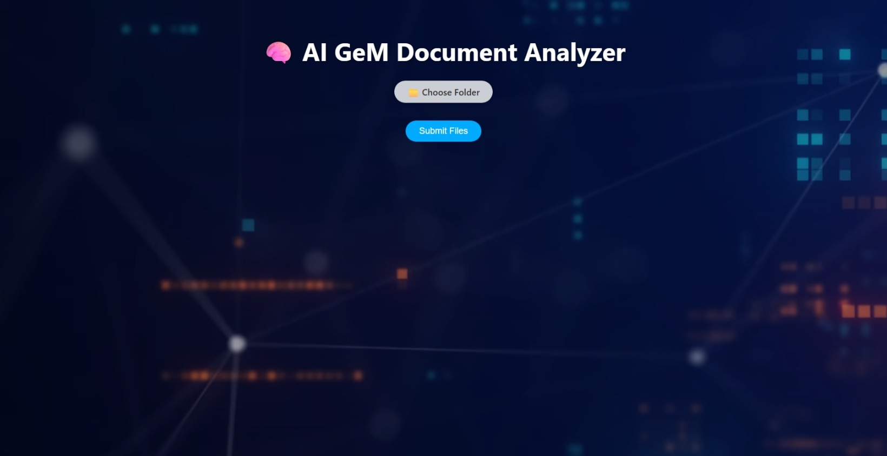
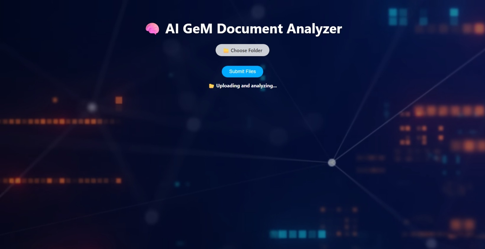

# 🧠 AI GeM Document Analyzer

A smart document analysis tool that classifies and summarizes government or technical PDF files like tenders, certificates, scripts, and receipts. It is especially tailored for analyzing documents uploaded to the Government e-Marketplace (GeM) portal or similar platforms.


## 💡 Features

- Upload and analyze multiple PDF documents
- Automatically classifies document type
- Summarizes the content in a tabular form
- Supports scripts, certificates, research papers, receipts, technical guides, and tenders
- Simple, beautiful web interface with dynamic updates

---

## 📁 Folder Structure

```
AI PDF Reviewer/
├── app.py                     # Optional Flask launcher
├── main.py                    # Main Streamlit app
├── runner.bat                 # Windows batch script to run app
├── ideas.txt                  # Notes or development ideas
├── new.docx                   # Documentation/notes
├── static/
│   ├── asus.css               # Custom CSS
│   ├── style.js               # Custom JS
│   └── thumbnails/
│       └── background.mp4     # Background animation
├── templates/
│   └── index.html             # (Legacy) HTML Template
├── uploads/                   # Sample uploads for demo
│   ├── document_summary.csv   # Output summary table
│   ├── hello.pdf              # Example document
│   └── ...                    # More sample PDFs
```

---

## 🖼 UI Screenshots

### 1. Launch Page



### 2. Upload and Analyze



### 3. Results Display


---

## 🚀 Getting Started

### ✅ Requirements

- Python 3.8+
- pip (Python package manager)

### 📦 Installation

1. **Clone the Repository:**
   ```bash
   gh repo clone vmaurya6622/AI-tools-website
   cd ai-pdf-reviewer
   ```

2. **Install Dependencies:**
   ```bash
   pip install -r requirements.txt
   ```

> If `requirements.txt` is not available, install manually:
```bash
pip install streamlit pandas PyMuPDF python-docx
```

---

## 🧠 How to Run

You can run the app in two ways:

### Option 1: Using Streamlit (Recommended)
```bash
streamlit run main.py
```

### Option 2: Using Flask (Optional)
```bash
python app.py
```

### Option 3: On Windows (Double Click)
Run the provided `runner.bat` file.

---

## 📂 Upload Sample PDFs

Upload your PDF files using the “Choose Folder” button in the web UI. The system will automatically analyze the files and present:

- Serial Number
- PDF File Name
- Document Type
- Summary of the Document

---

## 🔧 Customization

- Modify **static/asus.css** to change UI theme
- Update **templates/index.html** if using Flask
- Background animation can be changed by replacing `background.mp4`

---

## 📌 Notes

- This tool is ideal for bulk document summarization
- The current model uses pattern-based text classification
- Future upgrades may include LLM-based classification and semantic search

---

## 🧑‍💻 Author

**Vishal Kumar Maurya**  
IIIT Delhi | Computer Science and Applied Mathematics

---

## 📜 License

This project is licensed under the MIT License.
